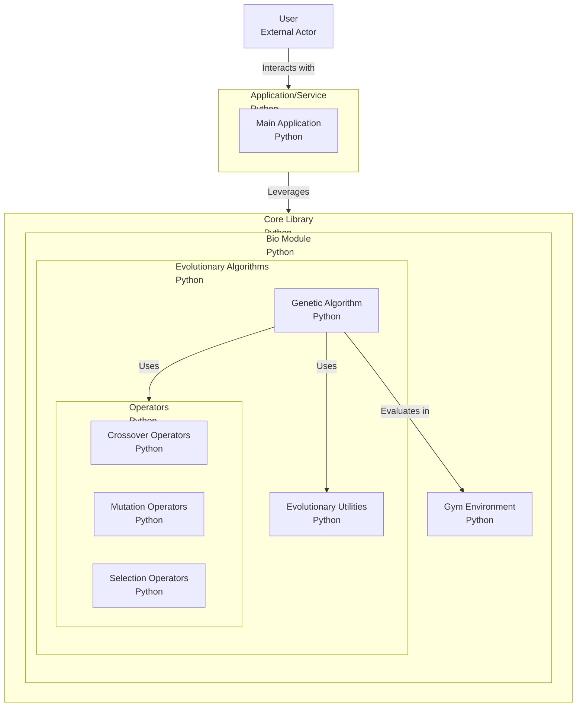

# MetaZoo

A zoo of metaheuristic algorithms (please do not feed them) for optimization.

> [!WARNING]
>
> This library is in preview and is not ready for production use.
>
> We're working hard to make this library stable and feature-complete, but until then, expect to encounter bugs,
> missing features, and fatal errors.

## Modules

- Bio-inspired
    - [-] Evolutionary Computation
        - [X] Genetic Algorithm (GA)
        - [ ] Evolution Strategies (ES)
        - [ ] Evolutionary Programming (EP)
        - [ ] Genetic Programming (GP)
        - [ ] Differential Evolution (DE)
    - [ ] Darwin (Swarm Intelligence and Other Animal-inspired Algorithms)
        - Swarm
            - [ ] Particle Swarm Optimization (PSO)
            - [ ] Ant Colony Optimization (ACO)
            - [ ] Artificial Bee Colony (ABC)
            - [ ] Firefly Algorithm (FA)
        - Animals
            - [ ] Cheetah Algorithm (CA)
            - [ ] Elephant Herding Optimization (EHO)
            - [ ] Lion Optimization Algorithm (LOA)
            - [ ] Wolf Search Algorithm (WSA)
            - [ ] Wild Horse Optimizer (WHO)

- Physics-inspired
    - [ ] Phenomena Inspired
        - [ ] Simulated Annealing (SA)
    - [ ] Music-inspired
        - [ ] Harmony Search (HS)

- Human-inspired
    - [ ] Social System-inspired
        - [ ] Tabu Search (TS)
        - [ ] Culture Algorithm (CA)

## Learning Resources

### Petting zoo

PettingZoo is a small Streamlit app for visualizing and interacting with MetaZoo library.

It provides a user-friendly interface for exploring the various metaheuristic algorithms implemented in the MetaZoo library, allowing users to easily experiment with different algorithms and parameters.

### Playgrounds

Playgrounds is a collection of interactive Jupyter notebooks for experimenting with the MetaZoo library.

It provides a hands-on environment for users to explore and visualize the behavior of different metaheuristic algorithms.

## Architecture

